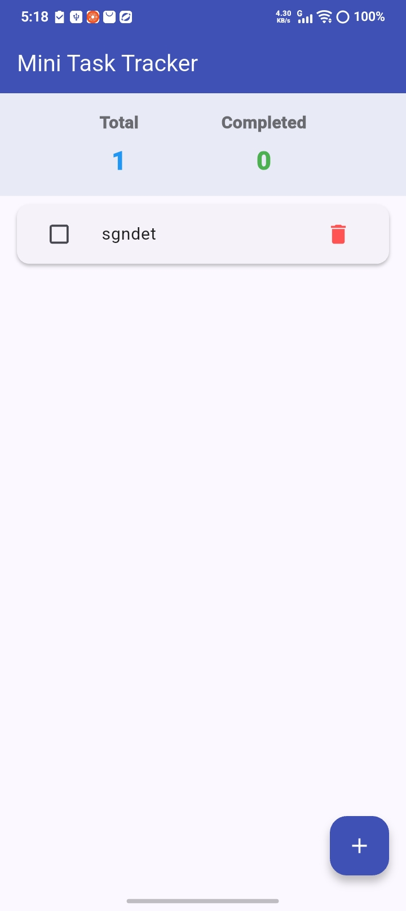

# Flutter Installation Task

## Objective
Install Flutter, verify the installation, create a sample Flutter application, and run it successfully.

## Environment
- Flutter: 3.44.2
- Dart: 3.12.2
- Platform: Windows 11
- Android SDK: 37.0.0


## Commands Used

```bash
flutter doctor
flutter create demo_app
cd demo_app
flutter run
```

## Result
- Flutter installed successfully.
- Flutter doctor executed successfully.
- Demo Flutter application created.
- Application ran successfully on an Android device.

## Screenshots
- flutter doctor
- Flutter app running on Android device
