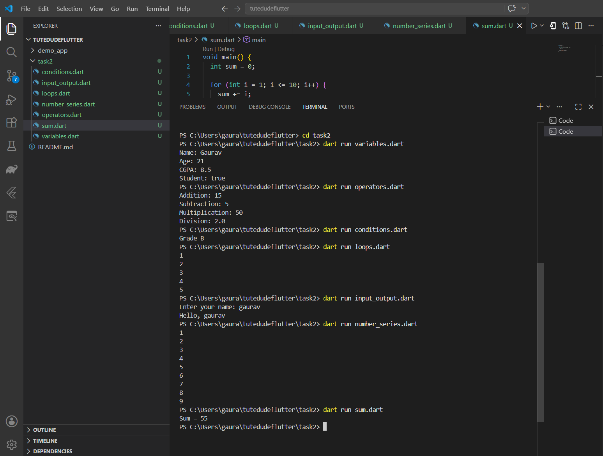

# Task 2

This folder contains basic Dart exercises:

- `variables.dart` — variables and data types
- `operators.dart` — arithmetic operators
- `conditions.dart` — if / else conditions
- `loops.dart` — for / while loops
- `input_output.dart` — console input and output

## How to run

1. Open the terminal.
2. Go to this folder:

```powershell
cd c:\Users\gaura\tutedudeflutter\task2
```

3. Run any file, for example:

```powershell
dart run variables.dart
```

## Notes

- Each file contains a `main()` function.
- Save your code before running.
- To run the input/output example, use `dart run input_output.dart`.
