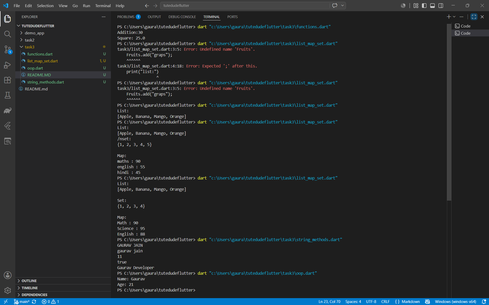

# Dart Basics (Part 2)

## Topics Covered

- Functions
- Lists
- Sets
- Maps
- String Manipulation
- Classes & Objects

## Run Commands

```bash
dart run functions.dart
dart run list_map_set.dart
dart run string_methods.dart
dart run oop.dart
```

## Screenshots


Add screenshots of each program's output in the `screenshots` folder.